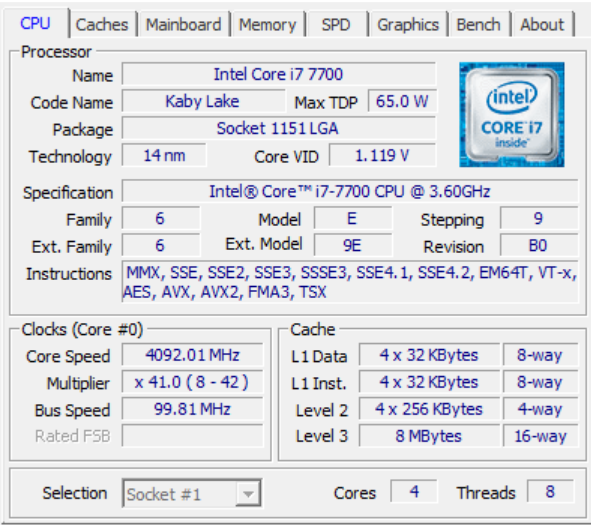

# Fast PI computing in C
This is a college assignment in which I use the <pthread.h> library in the C programming language to quickly compute PI using the n first terms of the **Bailey Borwein Plouffe** Formula.

The Formula Works as follows:

$$
\pi = \sum_{k=0}^{\infty}\left(\frac{4}{8k+1} - \frac{2}{8k+4} - \frac{1}{8k+5} - \frac{1}{8k+6} \right)\frac{1}{16^k}
$$
___

To build the program, use make in src:
```
>> C:\..\src 
>> make
gcc -o bin/main main.c compute_pi.c -pthread
```

To run, on src, use:
```
bin/main <PI-accuracy> <nthreads>
```
___
Some of the results from my computer.
```
>>> make | bin/main 1000000 1
    The approximation for PI is: 3.14159265358979310000
    proccess took 493.00 ms
```
```
>>> make | bin/main 1000000 8
    The approximation for PI is: 3.14159265358979310000
    proccess took 86.00 ms
```
I have the following specs for my CPU:
{width=400}